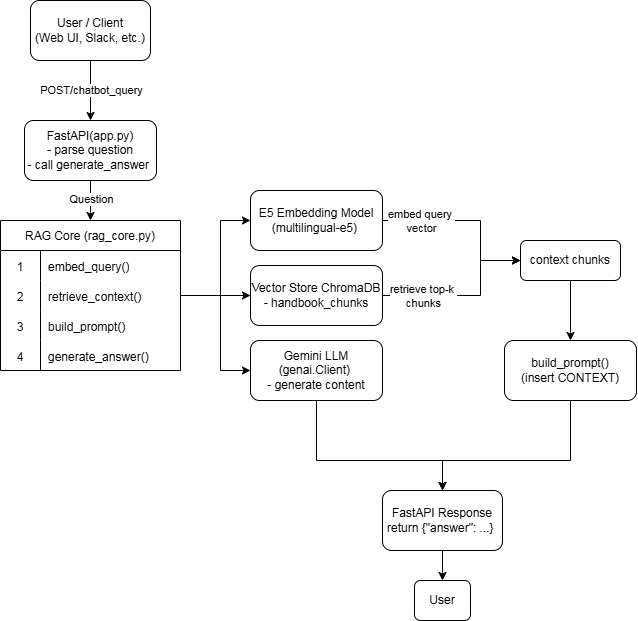

## Project Overview

This project implements an internal RAG-based (Retrieval-Augmented Generation) chatbot designed to support employees across various departments including HR, IT, Operations, and Product teams. The system enables staff to quickly access organizational knowledge such as policies, procedures, onboarding materials, technical guides, and common troubleshooting steps.

The chatbot is powered by:

The TTS Handbook dataset (an open-source, government-level organizational knowledge-base)

ChromaDB for vector storage and retrieval

Embedding models for semantic search

Google Gemini for natural-language generation

FastAPI for serving a lightweight /chatbot_query API endpoint

The dataset mirrors real-world enterprise documentation, containing content such as HR policies, IT support instructions (e.g., connecting to Wi-Fi, using printers, setting up accounts), onboarding materials, software tools guidance, project workflows, and employee resources. By augmenting the LLM with this structured knowledge, the chatbot produces accurate, context-grounded answers instead of hallucinated responses.

The result is a mini internal knowledge assistant that helps employees resolve common questions instantly, reduces repetitive workload for HR/IT teams, and provides a foundation for scalable enterprise AI support systems.

## Features

1. Internal RAG Chatbot for Enterprise Knowledge

Provides accurate answers to employee questions across HR, IT, Operations, and Product domains by combining semantic search with LLM generation.

2. Multi-Domain Knowledge Coverage

- The chatbot can respond to topics such as:

+ IT support (Wi-Fi, printers, accounts, tools)

+ HR policies (leave, benefits, onboarding, performance)

+ Organizational procedures

+ Software development and workflow guidelines

+ Tool documentation (Slack, GitHub, Google Workspace, Zoom, etc.)

3. Retrieval-Augmented Generation (RAG) Pipeline

Uses embeddings + vector search + Gemini LLM, enabling the system to generate context-grounded answers based strictly on real documents.

4. ChromaDB-Based Vector Store

- Stores all document embeddings and metadata, enabling:

+ Fast semantic search

+ Document filtering

+ Deterministic retrieval

5. Flexible Data Ingestion Pipeline

- Supports ingestion of:

+ Markdown documents (primary dataset)

+ PDFs, Word documents

+ Excel files

+ Images with OCR (if extended)

+ The included ingestion script automatically chunks, embeds, and stores the data.

6. Lightweight FastAPI Backend

- Exposes a single clean API endpoint:

+ POST /chatbot_query


-> This endpoint performs retrieval + generation and returns the final answer along with reference sources.

## System Architecture



The system architecture illustrates the complete flow of how a user’s question is processed through the RAG pipeline. When a user submits a query to the FastAPI endpoint, the request is forwarded into the RAG core module, where the question is embedded using the E5 multilingual embedding model. The resulting vector is used to retrieve the most relevant document chunks from the ChromaDB vector store. These chunks are then merged into a grounded prompt, which is sent to the Gemini LLM for final answer generation. The response is logged and returned to the user.

## Technologies Used

| Component      | Technology        |
|----------------|-------------------|
| **API Server** | FastAPI           |
| **Database**   | ChromaDB            |
| **LLM**        | Gemini 2.5 Flash  |
| **Language**   | Python 3.10       |

## Dataset 
1. **Overview Dataset**

The TTS Handbook is an extensive knowledge-base created by Technology Transformation Services (TTS), a division of the U.S. General Services Administration (GSA).
The entire dataset is fully open-source, publicly accessible, and contains no sensitive information or internal accounts.

Structured into 38 directories and 250+ Markdown files, the collection captures a wide range of organizational knowledge typically found inside a large government-level institution, including:

**- Team operations**

+ HR policies

+ Hiring and onboarding processes

+ Project management guidelines

+ Supervisor and leadership guidance

+ Technical tools and IT procedures

+ Partner and vendor collaboration practices

+ Travel and leave policies

+ Training and professional development

+ Conflict resolution and feedback practices

+ Security policies and technology standards

+ Leadership and management principles

You can browse the original repository here:
https://github.com/GSA-TTS/handbook/tree/main/pages

2. **Dataset Structure**

The TTS Handbook dataset is organized into clear directories, each representing a specific domain of organizational knowledge. Below is a concise breakdown of the major folders and their contents.

**- 18f**

+ Documentation for the 18F team, including:

+ Roles & disciplines: account manager, engineering, design, product, acquisition

+ Internal operations: business development, contractors, project lifecycle, research guidelines, staffing, agreements

+ Leadership materials: candidate guidance, leadership selection

+ Working with partners: consulting engineering, leading projects, project team guidance, distressed project handling

**- about-us**

+ Organizational information and foundational resources:

1. Code of conduct

2. Org charts

3. TTS consulting (mission, operations)

4. Internal communication guidance

5. Training and onboarding materials

**- general-information-and-resources**

+ Core policies and essential employee resources:

+ Business & operations: billing, IG CAP, classified-policy references

+ Employee resources: benefits, check-ins, transit, support programs, work schedules

+ Conflict feedback: frameworks and conflict-resolution guidance

+ Tech policies: passwords, bug bounty, open source, records, security incidents

+ Tools overview: approved software, purchase processes, general contacts

**- getting-started**

+ Primary onboarding materials:

1. Equipment setup

2. Login instructions

3. PIV

4. Welcome package

5. Initial classes and training

**- hiring-staying-or-changing-jobs**

+ Complete HR lifecycle:

1. Hiring processes

2. Hiring authorities

3. Promotions

4. Resume guidance

5. Offboarding

6. Term extensions

**- launching-software**

+ Technical and compliance documentation:

1. Security

2. Infrastructure

3. Legal requirements

4. Privacy

5. Product lifecycle processes

**- office-of-acquisition**

+ Procurement and acquisition workflows.

**- office-of-operations**

+ Operations-related resources:

1. BizOps

2. Blogging

3. Outreach & market development

4. Social media

5. Talent processes

**- office-of-solutions**

+ Materials on:

1. Organizational history

2. Org charts

3. Technology operations

4. Innovation portfolio

**- performance-management**

Employee performance evaluation materials:

1. Mid-year & end-of-year reviews

2. Supervisor resources

3. Annual review cycle timelines

**- supervisor-resources**

+ A comprehensive supervisor playbook (12 plays), covering management responsibilities and best practices.

**- tools**

+ Extensive tool documentation the most valuable section for IT-support chatbots:

1. Adobe, Airtable

2. Analytics tools

3. Docker Hub

4. GitHub

5. Google Workspace (Docs, Calendar, Meet, Groups)

6. Gmail

7. Mural

8. New Relic

9. Microsoft Office

10. Slack

11. Smartsheet

12. Teams

13. Trello

14. VMware

15. Zoom

16. Shared calendars

17. Text editors

18. Includes a specialized Slack subdirectory:

19. Getting started

20. Guidelines

21. Integrations

22. Notifications

23. User management

24. Records

**- training-and-development**

+ Materials for professional growth:

1. Conferences

2. Development programs

3. GitHub introduction

4. Working groups

5. PRA for user research

**- travel-and-leave**

+ HR-level travel and leave documentation:

1. FMLA

2. Leave policies

3. Overtime

4. Paid parental leave

5. Travel guides

6. Out-of-office procedures

7. Emergency travel

8. Reimbursements

## Installation

For this project, **python=3.10** are used.

1. **Clone the repository.**

   ```bash
   git clone https://github.com/anhnd210020/company_internal_chatbot.git
   cd company_internal_chatbot
   ```

2. **Create a virtual environment for Supestore and and activate the environment.**

   ```bash
   conda create -n chatbot python=3.11
   conda activate chatbot
   ```

3. **Install other dependencies.**

   ```bash
   pip install -r requirements.txt
   ```

## Environment Variables (.env)

Create a `.env` file in the project root directory with the following content:

   ```bash
   GEMINI_API_KEY="your_api_key_here"
   ```

## Run the API Server

To start the FastAPI server, run the following command in the project root:

   ```bash
   uvicorn api:app --reload 
   ```

After that, you can access the API documentation at:

   ```bash
   http://127.0.0.1:8001/docs
   ```

## File Organization
```text
.
├── api.py                      # FastAPI: /chatbot_query endpoint
├── config.py                   # Gemini, embeddings, and Chroma configuration
├── rag_core.py                 # RAG logic: retrieval + generation
├── ingest_handbook.py          # Ingest TTS Handbook into ChromaDB
│
├── pages/                      # TTS Handbook dataset (Markdown files)
│   ├── 18f/                    # 18F team: history, projects, leadership
│   ├── about-us/               # Organization info, code of conduct, org chart
│   ├── general-information-and-resources/  # Policies, employee resources, tech policies
│   ├── getting-started/        # Onboarding, equipment, login guides
│   ├── hiring-staying-or-changing-jobs/    # Hiring, promotions, role changes
│   ├── launching-software/     # Software lifecycle, security, privacy
│   ├── office-of-acquisition/  # Procurement processes, roles & responsibilities
│   ├── office-of-operations/   # BizOps, outreach, internal communications
│   ├── office-of-solutions/    # Tech operations, innovation portfolio
│   ├── performance-management/ # Performance reviews: mid-year, end-year
│   ├── supervisor-resources/   # Supervisor playbook and management guides
│   ├── tools/                  # Guides for Slack, GitHub, Google, Zoom, etc.
│   ├── training-and-development/ # Training, conferences, working groups
│   ├── travel-and-leave/       # Leave policies, overtime, travel guidelines
│   └── updating-the-handbook/  # How to edit and update the handbook
│
├── chroma_db/                  # Chroma vector store (auto-generated after ingestion)
├── gemini_env/                 # Gemini environment / configuration
├── tts_handbook/               # Original TTS Handbook clone (optional)
│
├── README.md
├── requirements.txt
└── __pycache__/                # Python cache files
```

## Example Usage

### Example 1: General & About TTS

**Input**
```json
{
  "question": "What is the mission of TTS and how does it support government agencies?"
}
```

**Output**
```json
{
"answer": "The mission of TTS Consulting is to empower government partners to create better digital experiences to more effectively serve the American public, aiming to bring government into the digital age and transform the way it works.\n\nTTS supports government agencies by:\n*   Helping them find a starting point for digital modernization.\n*   Building staff capacity.\n*   Modernizing technology systems.\n*   Improving the public experience of government.\n*   Building and buying technology in better ways.\n*   Providing digital development and consulting services, including teaching agencies new digital skills.\n*   Implementing IT modernization.\n*   Strengthening partnerships and promoting innovation within government."
}
```

### Example 2: Getting Started & Onboarding

**Input**
```json
{
  "question": "I’m a new employee. What are the first steps I should take in my first week?"
}
```
**Output**
```json
{
"answer": "As a new employee, in your first week you should:\n\n*   Submit your timecard correctly.\n*   Have a 1:1 meeting with your chapter or center director.\n*   If you are with 18F, prepare to introduce yourself at Team Coffee.\n*   Set up your workspace to be comfortable and focused.\n*   Plan time in your day for breaks.\n*   Start building your support network by using virtual coffees to connect with teammates.\n*   Get familiar with the free Employee Assistance Program (EAP)."
}
```

### Example 3: HR, Jobs & Career Changes

**Input**
```json
{
  "question": "How does the hiring process at TTS generally work?"
}
```
**Output**
```json
{
"answer": "The TTS hiring process generally works as follows:\n\n1.  **Identify Need & Prioritization**: Hiring managers, in coordination with their Business Unit heads, identify a hiring need. Once identified, the need enters Talent's work queue for prioritization.\n2.  **Sourcing & Application**: TTS Talent sources diverse candidate pools through job boards, events, and encourages candidates to attend cross-TTS information sessions. Candidates apply without indicating specific TTS group(s) of interest.\n3.  **Candidate Review & Selection**: Hiring managers review resumes and select candidates of interest. Talent then reviews selected candidates to ensure they meet specialized experience requirements. Qualified candidates are contacted individually by Talent to discuss potential offices and determine their interest in proceeding. The number of candidates a hiring manager can select for interview is capped based on the number of hires needed.\n4.  **Interviewing**: All candidates receive interview questions in advance to promote a fair, equitable, and transparent process. Interviewers participate in training that covers unconscious bias, and Talent works with hiring teams on best practices for equity and inclusion in candidate evaluation, panel selection, interview conduct, note-taking, debriefing, and final selections.\n\nThroughout the process, TTS aims to incorporate equity and inclusion and adhere to Merit Systems Principles."
}
```

**Nguyễn Đức Anh**

University: Hanoi University of Science and Technology (HUST)

Email: [anh.nd210020@gmail.com](mailto:anh.nd210020@gmail.com)

Address: Hanoi, Vietnam

GitHub: [anhnd210020](https://github.com/anhnd210020)